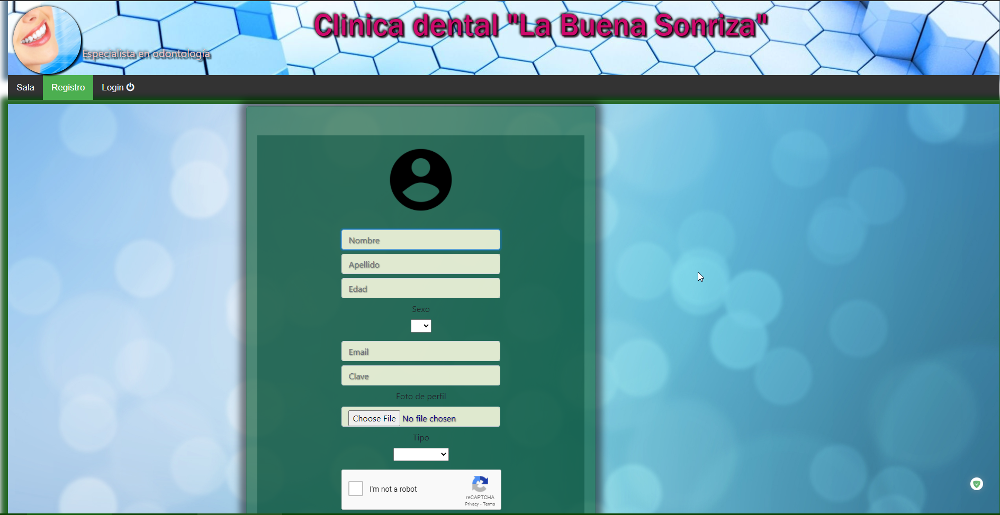
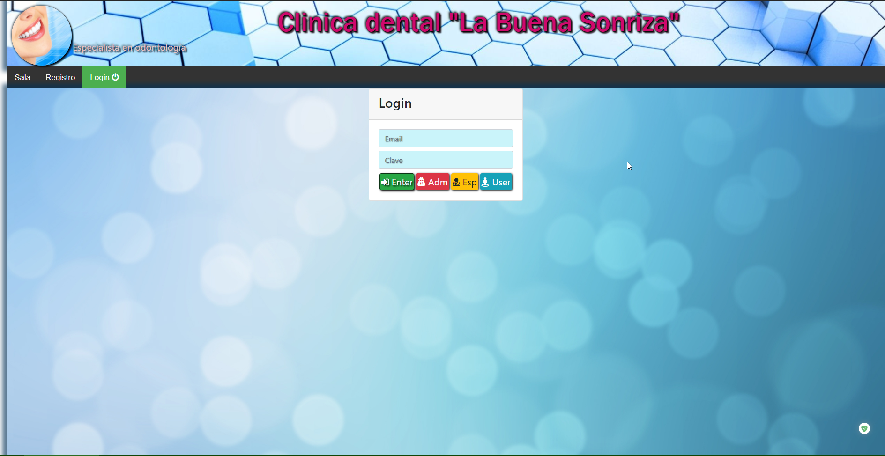
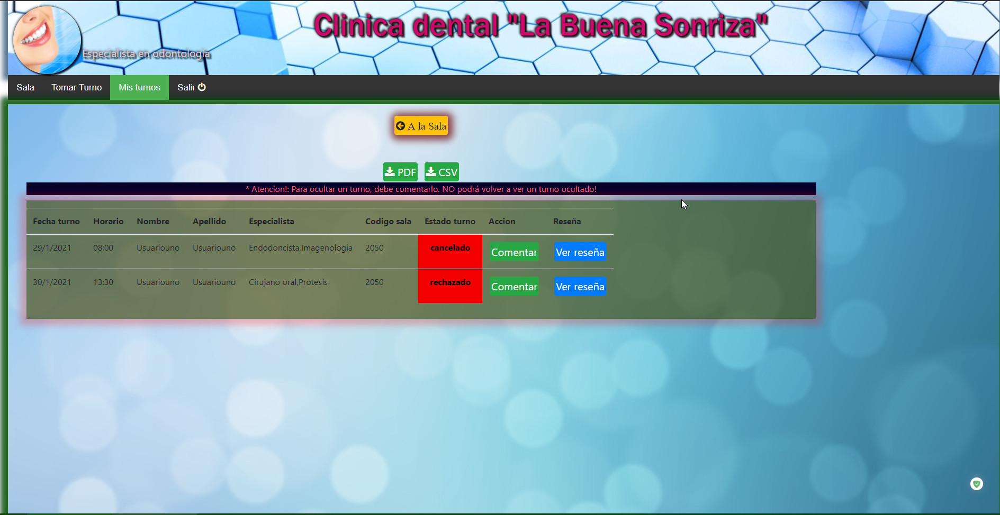
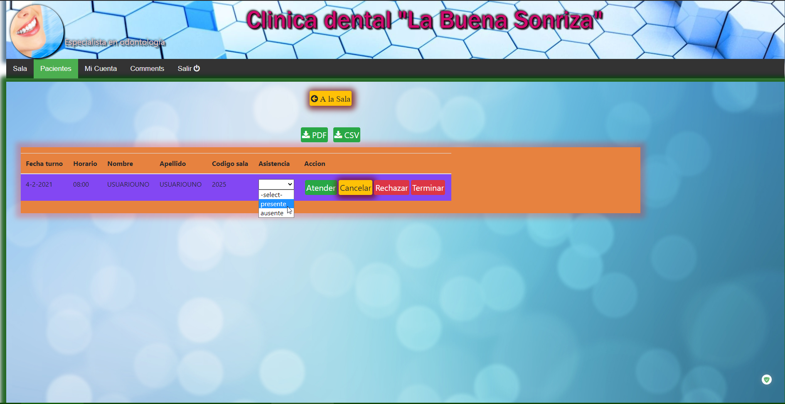
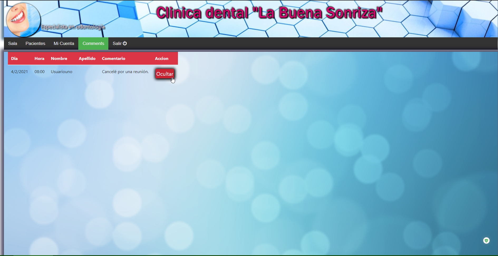
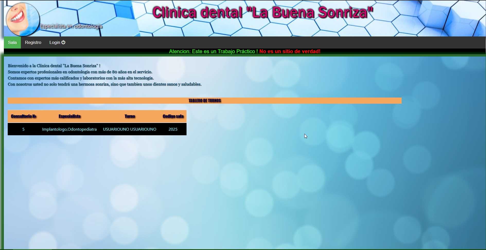
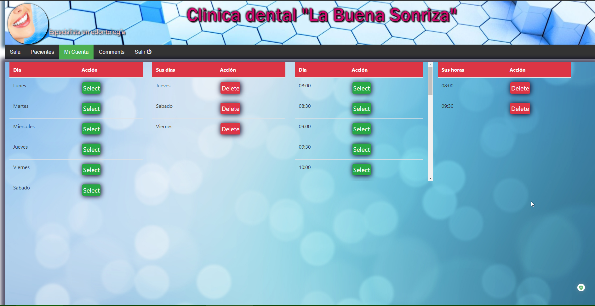
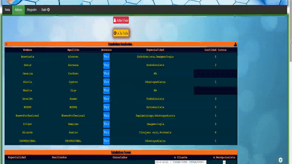

# Clinica dental "La buena sonriza" creado por Daniel K.  v. 3.0

- [Introduccion](#introduction)
- [Funcionamiento](#basic)
- [Testeo](#testeo)
- [Funcionamiento detallado](#detallado)
- [Errores y soluciones](#bugs)

#  Introduccion

Este sitio ha sido creado como un <b style="color: red">trabajo práctico</b> para evaluar los conocimientos de Programación en el lenguaje Angular.
El sitio <b style="color: red">no representa una clinica dental de verdad</b>. Todos los datos, así como perfiles y sus usuarios son falsos.
Usted puede testear el funcionamiento del sitio creando una cuenta o usar botones configurados mientras la base de datos a la cual el sitio está conectado exista.

* - Esta versión es una mezcla de dos versiones 2019 y 2020. 

#  Funcionamiento basico

La aplicación es muy simple de usar gracias a su clara y sencilla **Interfaz de Usuario**. 
Los siguientes son funciones básicas de cómo usar la aplicación:

<b>Usuario:</b>

- El usuario se registra apretando el boton **Registro**. La foto cargada <u>no tiene que ser mayor a **38780 bites**</u> y tener los formatos: .jpg, .jpeg o .gif.
- El usuario inicia sesión entrando al sistema apretando el botón **Login**. Ingresa su correo electrónico con el cual se registró y la clave.
- El usuario puede pedir turno **solo si entró en el sistema** apretando el botón **Tomar Turno**.
- El usuario puede ver sus turnos **activos**, **rechazados** y **finalizados**.  Puede comentar un turno **realizado**, **cancelado**  o **rechazado** para poder ocultarlo. Una vez ocultado <b style="color: red">no podrá volver a verlo</b>.

**:one:** Registro

**:two:** Login

**:three:** Tomar Turno

**:four:** Ver Turnos tomados

<b>Empleado:</b>

El empleado puede ser un **Especialista** o un/a **Recepcionista** (version 2019). En esta versión (2020) no hay Recepcionistas.

- El empleado entra en el sistema con sus correo electrónico y la clave. 
- El empleado tiene acceso a datos como: "Ver, cancelar y rechazar turnos" en la sección "Pacientes". Vea la sección **[Funcionamiento detallado](#detallado)**.

#  Testeo

Para poder testear el sitio usted puede crear una cuenta. Por favor no abusar con la creación de cuentas así como crear turnos, comentarios, reseñas, etc.
ya que llenará mucho la base de datos. También puede usar botones ya preinstalados cuando hace click en "Login", para entrar en el sistema con datos ya cargados. 
Los botones pre cargados son: Enter (debe ingresar datos primero), Adm (cuenta de Admin), Esp (cuenta de Especialista), User (cuenta de un Usuario). Con estos botones 
salvo con el "Enter" se puede entrar al sistema automáticamente y ver todo su funcionamiento sin tener que crear una cuenta.

#  Funcionamiento detallado

>A continuación se describe la funcionalidad más detallada del sitio

## Sala principal o sala  de espera
Es la página principal en la que aparecen los turnos del día. Es decir: el especialista llama al paciente cuyo nombre, apellido y código sala 
aparesen luego en el tablero indicando el número de consultorio y el especialista. Una notificación suena cada vez que un paciente es llamado.

Después de terminar la consulta, el Especialista oprime el botón <b style="color: red">Terminar</b> y el turno desaparece del tablero.

## Mis turnos (Usuario)
Es la página en la que el usuario (paciente) puede ver los turnos que ha pedido. Puede comentar los turnos finalizados, cancelados o rechazados y ver reseñas (descripción de trabajos del Especialista).
Las opciones "Accion" y "Reseña" solo aparecen cuando el turno es finalizado, cancelado o rechazado.

## Mi Cuenta (Profesional)
Es la página en la que el Profesional puede gestionar sus días y horarios en los que atiende. Puede añadir o quitar tanto días como horas.

## Botón Pacientes (Profesional)
Este botón permite navegar hacia una página que muestra una lista de turnos que el Especialista tiene para el día de la fecha. 
Puede marcar la asistencia de los pacientes, escribir reseñas y llamar a proximo paciente si hay más turnos.
Para poder llamar al paciente el Especialista oprime el botón <b style="color: red">Atender</b> y en el tablero de la sala de espera aparecen los datos del turno avisando al paciente.
Puede aceptar, cancelar o rechazar un turno escribiendo luego una reseña para avisar al paciente de lo sucedido.

Al apretar sobre <b style="color: red">Terminar</b>, se abre un campo de texto para describir los trabajos realizados con el paciente (reseña).

## Botón Comments (Profesional)
Permite que el Profesional pueda ver los comentarios que los Pacientes escriben luego de su visita con el Especialista.

## Administrador
El Administrador del sitio tiene acceso a una página en la que puede ver diferentes estadisticas sobre Los Empleados, Turnos, Especialidades, etc.
Puede dar de alta a nuevos pacientes o empleados.
El sitio tiene unas funciones secretas que solo el Administrador o el Administrador de la base de datos del sitio los conoce.
- Si se oprime sobre la imagen del logotipo se escuchará un sonido feliz.
- Se puede cerrar el sitio desde la página del Admin apretando sobre el icono en forma de un **engranaje** (casi invisible) en la parte izquierda del primer titulo de estadísticas.
- Se puede abrir el sitio apretando sobre el engranaje que se encuentra después de la palabra "Cerrado" cuando el sitio está cerrado. **Es invisible el ícono**.

#  Errores y soluciones

La aplicación ha sido testeada y actualmente no se detectaron errores. Algunas veces puede pasar que la aplicación se trave por algún motivo desconocido.
A continuación presentamos una lista de posibles causas y sus soluciones.

Posible causa | Solución
---------------------------------|-----------------------------------------------------------------------------------------------------------------------------
Al oprimir el botón **Submit** al momento de registrarse parece que no ocurre nada o el spinner gira sin parar. | Verifique su conección a Internet. Refresque la página y vuelva a intentar. Asegurese de apretar una sola vez el botón **Submit**. Si aparece el mensaje de que el correo electrónico ya existe - pruebe con otro.
Pedí un turno, pero este no aparece en Mis datos. | Vuelve a la página principal (sala de espera) con el botón **A la Sala**. Ahora intente ver los datos otra vez. Si el problema persiste, salga del sistema y vuelva a entrar.

>Por algún otro inconveniente mandarme un e_mail a: yoyodanyo@gmail.com

&copy; La Buena Sonrisa S.A. &nbsp; Creado por Daniel K.
